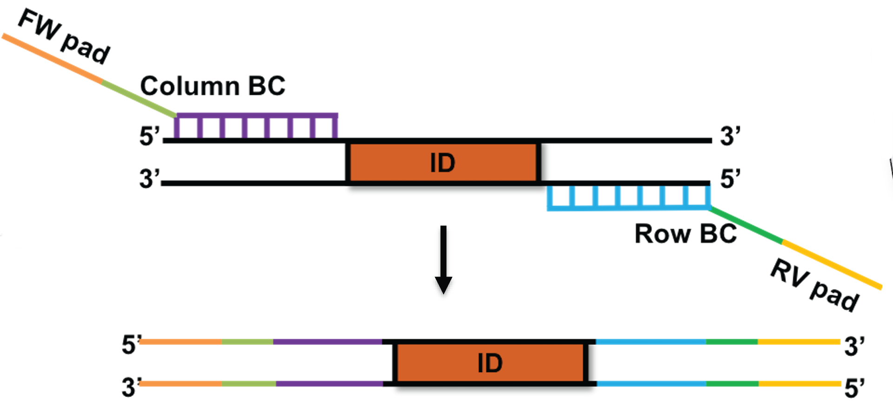

# Plasmid-ID
Tagging strains using high-density ID reporter plasmids


## Dependencies

In order to use ```Plasmid-ID``` you must install the following libraries:

* Pandas
* BioPython


```sh
pip3.7 install pandas
pip3.7 install biopython

```

## Input files



### Plasmid ID sequences

The barcode sequence corresponding to each amplicon must be provided in a file with the following columns: ```Barcode name``` and ```ID plasmid sequence```. The headers of the columns ***must*** match the names described above. The file may have extra columns for reference in the downstream analysis. 

```csv
Barcode name,ID plasmid sequence
806rcbc0,TCCCTTGTCTCC
806rcbc1,ACGAGACTGATT
806rcbc2,GCTGTACGGATT
806rcbc3,ATCACCAGGTGT
806rcbc4,TGGTCAACGATA
806rcbc5,ATCGCACAGTAA
806rcbc6,GTCGTGTAGCCT
806rcbc7,AGCGGAGGTTAG
```


See ```examples/plasmids.csv``` for further reference. This corresponds to ```ID``` in the diagram above. 

### Barcode sequences. 

The sequence of the forward and reverse primers that where used to amplify the different plasmids. The sequences must be in fasta format. ```Plasmid-ID``` uses the forward and reverse complement of each sequence.  This correspond to ```Column BC``` and ```Row BC``` in the figure above. 


FW_BC.fa
```
>1F_BC_IT   
GCTACATCACGCATGGTATGGA
>2F_BC_IT   
TGTGTCATCACGCATGGTATGGA
```

RV_BC.fa
```
>A1R    
GCTCCCCAGTCACGACGTTGTAAAACG
>B2R    
CTAGTCCCAGTCACGACGTTGTAAAACG
```


### IonTorrent reads

The raw sequences from IonTorrent in ```fastq.gz``` format. The quality is not used in the program, as the assumption is that the coverage is high enough that the number of amplicons will be enough to discard the noise. In general, the threshold is to remove sequences that appear less in than 2% of the sample. 


## Running the program 

To run the program, the following command can be used

```
python3.7 bin/tag_tables.py --plasmid=examples/plasmids.csv --forward=examples/FW_BC.fa --reverse=examples/RV_BC.fa --sequences=examples/10000_sample.fq.gz --output=sample_10000
```

All the arguments are required and the inputs are described above. 


## Outputs

There are two files ```distances_merge.txt``` and ```summary_merge.csv```. 

### distances_merge.txt

Contains the details of each ```fastq``` entry in the same order as they where inputed. the columns are: 

* **fw_name** ID of the ```Column BC``` that is attached to the forward primer. 
* **fw_pos** Position where the ```Column BC``` is located. Most of them should be 0. 
* **rev_name** ID of the ```Row BC``` that is attached to the reverse primer. 
* **rev_pos** Position where the ```Column BC``` is located. They should be the size of the Plasmid ```ID``` plus the size of the ```Column BC```
* **pl_name** Name of the plasmid
* **pl_pos** Size of the plasmid. 
* **orientation** ORientation of the found sequences. They should be "+", as the expectation is that the amplicons where sequenced in the same orientation. 

Running the command above should produce a file starting like this: 

```
fw_name,fw_pos,rev_name,rev_pos,pl_name,pl_pos,orientation
5F_BC_IT,0,G7R,55,806rcbc42,43,+
4F_BC_IT,0,G7R,54,806rcbc40,42,+
9F_BC_IT,1,F6R,57,806rcbc62,45,+
4F_BC_IT,0,E5R,55,806rcbc40,43,+
11F_BC_IT,0,B2R,55,806rcbc62,43,+
7F_BC_IT,0,B2R,54,806rcbc62,42,+
```

### summarye_merge.csv

This file contains the counts of the observations of each plasmid and their corresponding barcodes. The columns are:

* **fw_name** ID of the ```Column BC``` that is attached to the forward primer. 
* **rev_name** ID of the ```Row BC``` that is attached to the reverse primer. 
* **pl_name** Name of the plasmid
* **pl_pos count** How many times the plasmid is observed. This column is used in the downstram analysis to filter out the plasmids with low frequency. 
* **pl_pos mean** Average size of the plasmid. Used as a sanity check. 

Running the command above should produce a file starting like this: 

```
,,,pl_pos,pl_pos
,,,count,mean
fw_name,rev_name,pl_name,,
10F_BC_IT,A1R,806rcbc40,1,42.0
10F_BC_IT,A1R,806rcbc76,36,42.138888888888886
10F_BC_IT,A1R,none,1,-1.0
10F_BC_IT,B2R,806rcbc62,57,42.0
10F_BC_IT,B2R,none,5,-1.0
```


